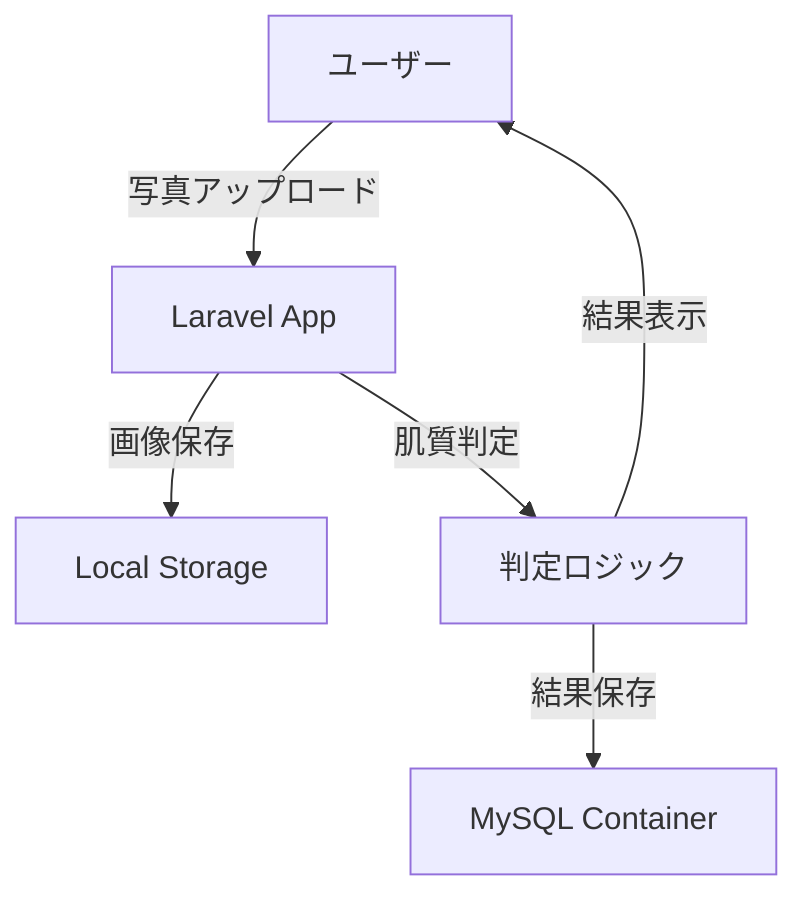
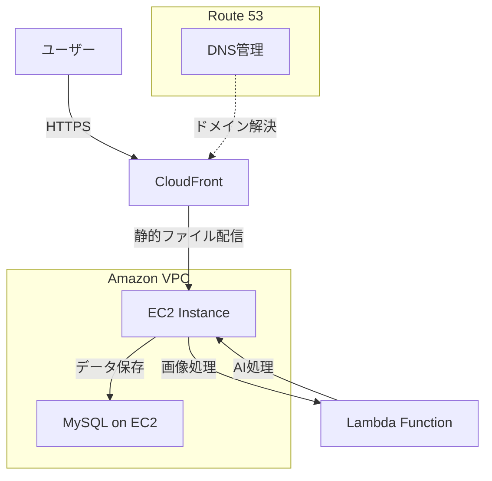

## 📖 概要

AI技術を活用したシンプルな肌診断アプリケーション（ポートフォリオプロジェクト）です。写真をアップロードするだけで、基本的な肌質を判定し、結果を表示します。

### 主な特徴

- 📸 **画像アップロード**: 簡単な写真アップロード機能
- 🤖 **AI判定**: 基本的な肌質分類
- 📱 **シンプルUI**: 使いやすいインターフェース
- 🐳 **Docker対応**: 簡単セットアップ
- ☁️ **AWS運用**: AWSを活用したインフラ構成

## 🏗️ システム構成

### バックエンド
- **Laravel 11** - PHP Webフレームワーク
- **MySQL 8.0** - データベース

### フロントエンド
- **Laravel Blade** - テンプレートエンジン
- **Bootstrap 5** - CSSフレームワーク

### 開発環境
- **Docker** - コンテナ化
- **Apache** - Webサーバー

### AWS インフラ構成
- **VPC** - 仮想プライベートクラウド（セキュアなネットワーク環境）
- **EC2** - アプリケーションサーバー
- **CloudFront** - CDN（静的ファイル配信・キャッシュ）
- **Lambda** - 画像処理・AI分析処理（必要に応じて）
- **Route53** - DNS管理（独自ドメイン対応予定）

## システムフロー

### 開発環境


### 本番環境（AWS）


## �🚀 機能一覧

### 🔍 肌診断機能
- 写真アップロード
- 肌質判定（乾燥肌・脂性肌・混合肌・普通肌）
- 結果表示

### 📱 基本機能
- ホーム画面
- 診断画面
- 結果画面

## 📦 インストール

### Docker環境での開発

#### 前提条件
- Docker Desktop
- Git
- GitHub

#### リポジトリクローン
```bash
git clone https://github.com/yagamin2783/skin.git
cd skin
```

#### アクセス
- **アプリケーション**: http://localhost:8080

## 📋 実装予定

### Phase 1（ローカルでの検証）
- [〇] Docker環境構築
- [ ] Laravel基本セットアップ
- [ ] 画像アップロード機能
- [ ] 簡単な肌質判定ロジック
- [ ] 結果表示画面

### Phase 2（機能拡張）
- [ ] UI/UX改善
- [ ] 判定精度向上
- [ ] 結果保存機能

### Phase 3（AWS本番環境）
- [〇] VPC・セキュリティグループ設定
- [ ] EC2インスタンス構築（MySQL含む）
- [ ] CloudFront 配信設定
- [ ] Lambda 画像処理機能（オプション）
- [ ] Route53 DNS設定

## EC2へのデプロイ準備等
- [ ] EC2に接続
- [ ]
- [ ]
- [ ]

## 🎯 ポートフォリオのポイント

### 技術スキル
- **Laravel** - PHPフレームワークの理解
- **Docker** - コンテナ技術の活用
- **MySQL** - データベース設計

### AWS クラウド技術
- **VPC** - ネットワーク設計・セキュリティ
- **EC2** - 仮想サーバー管理・アプリケーション配置
- **CloudFront** - CDN設定・パフォーマンス最適化
- **Lambda** - サーバーレス処理（オプション）
- **Route53** - DNS管理・ドメイン運用

### 開発プロセス
- **Git** - バージョン管理
- **MVC** - 設計パターンの理解
- **CI/CD** - 継続的デプロイメン

**開発者**: [yagamin2783](https://github.com/yagamin2783)
**プロジェクト**: ポートフォリオ用肌診断アプリ

### 学べたこと
・dockerの環境構築について
・Laravelの基礎について
・実務で経験してこなかった、GitHubの使用について
・デプロイについて
　参考サイト
  https://qiita.com/kaino5454/items/bae4bca47e6f409e072f