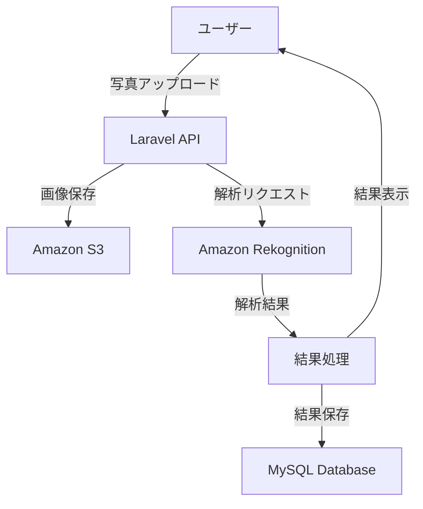

## 📖 概要

本アプリケーションは、AI技術を活用したシンプルな肌診断システムです。ユーザーが写真をアップロードすると、基本的な肌質を判定し、結果を表示します。

### 主な特徴

- 📸 **AI画像解析**: 基本的な肌診断アルゴリズム
- 💡 **肌質判定**: 肌タイプの自動分類
- � **Docker対応**: コンテナ化による簡単デプロイ
- 🔐 **セキュア**: 基本的なセキュリティ対応

## 🏗️ システム構成

### バックエンド
- **Laravel 12** - PHP Webアプリケーションフレームワーク
- **MySQL 8.0** - データベース（Dockerコンテナ）

### コンテナ化
- **Docker** - アプリケーションコンテナ化
- **Docker Compose** - マルチコンテナ管理
- **apache** - Webサーバー

### AWS サービス（最小構成）
- **VPC** - 仮想プライベートクラウド
- **SG** - セキュリティグループ（アクセス制御）
- **EC2** - 仮想サーバー（アプリケーションホスティング）
- **CloudFront** - CDN（コンテンツ配信ネットワーク）
- **S3** - オブジェクトストレージ（画像保存）
- **Rekognition** - 基本的な顔・肌分析API

## 🔄 システムフロー



## 🚀 機能一覧

### 🔍 肌診断機能
- **基本分析**
  - 肌質判定（乾燥肌・脂性肌・混合肌・敏感肌）
  - 肌色分析
  - 基本的な肌状態評価

### 📈 データ管理
- **結果保存**
  - 診断結果の保存
  - 履歴一覧表示

### 👥 ユーザー管理
- **基本認証**
  - ユーザー登録・ログイン
  - プロフィール管理

## 📦 インストール

### Docker環境での開発（推奨）

#### 前提条件
- Docker Desktop
- Docker Compose
- Git

#### 1. リポジトリクローン
```bash
git clone https://github.com/yagamin2783/skin.git
cd skin
```

#### 2. Docker環境の起動
```bash
# 環境ファイルコピー
cp .env.example .env

# Dockerコンテナ起動
docker-compose up -d

# 依存関係インストール
docker-compose exec app composer install

# アプリケーションキー生成
docker-compose exec app php artisan key:generate

# データベース初期化
docker-compose exec app php artisan migrate
docker-compose exec app php artisan db:seed
```

#### 3. アクセス確認
- **アプリケーション**: http://localhost:8080
- **データベース**: localhost:3306 (MySQL)

### ローカル環境での開発

#### 1. リポジトリクローン
```bash
git clone https://github.com/yagamin2783/skin.git
cd skin
```

#### 2. 依存関係インストール
```bash
# PHP依存関係
composer install
```

#### 3. 環境設定
```bash
# 環境ファイルコピー
cp .env.example .env

# アプリケーションキー生成
php artisan key:generate
```

#### 4. データベース設定
```bash
# マイグレーション実行
php artisan migrate

# シーダー実行
php artisan db:seed
```

## ⚙️ 設定

### 環境変数
```env
# アプリケーション
APP_NAME="Skin Analysis App"
APP_ENV=local
APP_DEBUG=true
APP_URL=http://localhost:8080

# データベース（Docker使用時）
DB_CONNECTION=mysql
DB_HOST=db
DB_PORT=3306
DB_DATABASE=skin_analysis
DB_USERNAME=root
DB_PASSWORD=secret

# AWS設定（S3とRekognition用）
AWS_ACCESS_KEY_ID=your-access-key
AWS_SECRET_ACCESS_KEY=your-secret-key
AWS_DEFAULT_REGION=ap-northeast-1
AWS_BUCKET=your-skin-app-bucket
```

## 🚀 デプロイ

### AWS EC2デプロイ
```bash
# アプリケーション最適化
php artisan config:cache
php artisan route:cache
php artisan view:cache

# ファイル権限設定
sudo chown -R www-data:www-data storage bootstrap/cache
sudo chmod -R 775 storage bootstrap/cache
```

### Docker デプロイ

#### 開発環境
```bash
# 開発環境起動
docker-compose up -d

# ログ確認
docker-compose logs -f

# コンテナ停止
docker-compose down
```

#### 本番環境
```bash
# 本番用イメージビルド
docker build -f Dockerfile.prod -t skin-analysis-app:latest .

# 本番環境起動
docker-compose -f docker-compose.prod.yml up -d

# ヘルスチェック
docker-compose ps
```

#### Docker構成ファイル

**docker-compose.yml**
```yaml
version: '3.8'
services:
  app:
    build: .
    ports:
      - "8080:80"
    environment:
      - APP_ENV=local
    volumes:
      - .:/var/www/html
    depends_on:
      - db

  db:
    image: mysql:8.0
    environment:
      MYSQL_DATABASE: skin_analysis
      MYSQL_ROOT_PASSWORD: secret
    ports:
      - "3306:3306"
    volumes:
      - mysql_data:/var/lib/mysql

volumes:
  mysql_data:
```

**Dockerfile**
```dockerfile
FROM php:8.4-apache

# 必要なパッケージインストール
RUN apt-get update && apt-get install -y \
    git \
    curl \
    zip \
    unzip \
    && rm -rf /var/lib/apt/lists/*

# PHP拡張インストール
RUN docker-php-ext-install pdo pdo_mysql

# Composerインストール
COPY --from=composer:latest /usr/bin/composer /usr/bin/composer

# Apache設定
RUN a2enmod rewrite

# 作業ディレクトリ設定
WORKDIR /var/www/html

# アプリケーションファイルコピー
COPY . .

# 依存関係インストール
RUN composer install --optimize-autoloader --no-dev

# 権限設定
RUN chown -R www-data:www-data storage bootstrap/cache
RUN chmod -R 775 storage bootstrap/cache

EXPOSE 80
```

## 📊 API仕様

### 肌診断API
```http
POST /api/v1/skin-analysis
Content-Type: multipart/form-data

{
  "image": "画像ファイル",
  "user_id": "ユーザーID"
}
```

### 診断結果取得
```http
GET /api/v1/analysis-results/{id}
Authorization: Bearer {token}

Response:
{
  "id": 1,
  "user_id": 123,
  "skin_type": "combination",
  "analysis_result": "基本的な肌分析結果",
  "created_at": "2025-09-02T10:00:00Z"
}
```

## 🧪 テスト

```bash
# PHPテスト
php artisan test
```

## 🤝 コントリビューション

1. フォークを作成
2. フィーチャーブランチを作成 (`git checkout -b feature/new-feature`)
3. 変更をコミット (`git commit -m 'Add new feature'`)
4. ブランチにプッシュ (`git push origin feature/new-feature`)
5. プルリクエストを作成