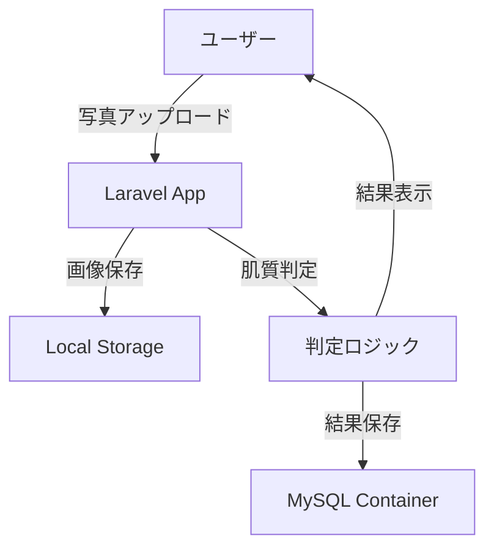
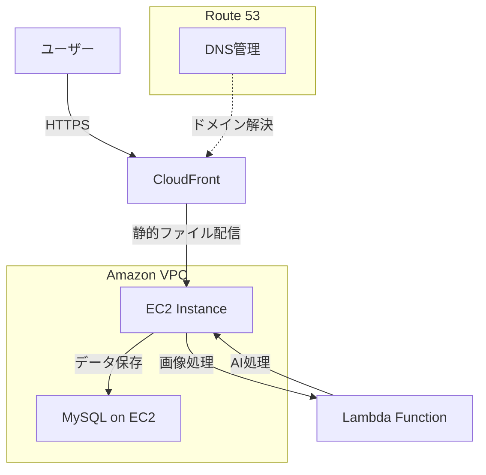

## 📖 概要

AI技術を活用したシンプルな肌診断アプリケーション（ポートフォリオプロジェクト）です。写真をアップロードするだけで、基本的な肌質を判定し、結果を表示します。

### 主な特徴

- 📸 **画像アップロード**: 簡単な写真アップロード機能
- 🤖 **AI判定**: 基本的な肌質分類
- 📱 **シンプルUI**: 使いやすいインターフェース
- 🐳 **Docker対応**: 簡単セットアップ
- ☁️ **AWS本格運用**: 実運用レベルのインフラ構成

## 🏗️ システム構成

### バックエンド
- **Laravel 11** - PHP Webフレームワーク
- **MySQL 8.0** - データベース

### フロントエンド
- **Laravel Blade** - テンプレートエンジン
- **Bootstrap 5** - CSSフレームワーク

### 開発環境
- **Docker** - コンテナ化
- **Apache** - Webサーバー

### AWS インフラ構成
- **VPC** - 仮想プライベートクラウド（セキュアなネットワーク環境）
- **EC2** - アプリケーションサーバー
- **CloudFront** - CDN（静的ファイル配信・キャッシュ）
- **Lambda** - 画像処理・AI分析処理（必要に応じて）
- **Route53** - DNS管理（独自ドメイン対応予定）

## � システムフロー

### 開発環境


### 本番環境（AWS）


## �🚀 機能一覧

### 🔍 肌診断機能
- 写真アップロード
- 肌質判定（乾燥肌・脂性肌・混合肌・普通肌）
- 結果表示

### 📱 基本機能
- ホーム画面
- 診断画面
- 結果画面

## 📦 インストール

### Docker環境での開発

#### 前提条件
- Docker Desktop
- Git

#### 1. リポジトリクローン
```bash
git clone https://github.com/yagamin2783/skin.git
cd skin
```

#### 2. Docker環境の起動
```bash
# Dockerコンテナ起動
docker-compose up -d

# Laravel初期設定
docker-compose exec app composer install
docker-compose exec app cp .env.example .env
docker-compose exec app php artisan key:generate
docker-compose exec app php artisan migrate
```

#### 3. アクセス
- **アプリケーション**: http://localhost:8080

## ⚙️ 設定

### 環境変数
```env
APP_NAME="Skin Analysis"
APP_ENV=local
APP_DEBUG=true
APP_URL=http://localhost:8080

DB_CONNECTION=mysql
DB_HOST=db
DB_PORT=3306
DB_DATABASE=skin_analysis
DB_USERNAME=t.handa
DB_PASSWORD=UEsQr357!
```

## 🐳 Docker構成

**docker-compose.yml**
```yaml
version: '3.8'
services:
  app:
    build: .
    ports:
      - "8080:80"
    volumes:
      - .:/var/www/html
    depends_on:
      - db

  db:
    image: mysql:8.0
    environment:
      MYSQL_DATABASE: skin_analysis
      MYSQL_ROOT_PASSWORD: UEsQr357!
      MYSQL_USER: t.handa
      MYSQL_PASSWORD: UEsQr357!
    volumes:
      - mysql_data:/var/lib/mysql

volumes:
  mysql_data:
```

**Dockerfile**
```dockerfile
FROM php:8.4-apache

RUN apt-get update && apt-get install -y \
    git \
    curl \
    zip \
    unzip \
    && rm -rf /var/lib/apt/lists/*

RUN docker-php-ext-install pdo pdo_mysql

COPY --from=composer:latest /usr/bin/composer /usr/bin/composer

RUN a2enmod rewrite

WORKDIR /var/www/html

COPY . .

RUN composer install --optimize-autoloader

RUN chown -R www-data:www-data storage bootstrap/cache
RUN chmod -R 775 storage bootstrap/cache

EXPOSE 80
```

## 📋 実装予定

### Phase 1（MVP）
- [ ] Docker環境構築
- [ ] Laravel基本セットアップ
- [ ] 画像アップロード機能
- [ ] 簡単な肌質判定ロジック
- [ ] 結果表示画面

### Phase 2（機能拡張）
- [ ] UI/UX改善
- [ ] 判定精度向上
- [ ] 結果保存機能

### Phase 3（AWS本番環境）
- [ ] VPC・セキュリティグループ設定
- [ ] EC2インスタンス構築（MySQL含む）
- [ ] CloudFront 配信設定
- [ ] Lambda 画像処理機能（オプション）
- [ ] Route53 DNS設定

## 🚀 デプロイ

### 開発環境（Docker）
```bash
# 本番用最適化
docker-compose exec app php artisan config:cache
docker-compose exec app php artisan route:cache
docker-compose exec app php artisan view:cache
```

## 🎯 ポートフォリオのポイント

### 技術スキル
- **Laravel** - PHPフレームワークの理解
- **Docker** - コンテナ技術の活用
- **MySQL** - データベース設計
- **Bootstrap** - レスポンシブデザイン

### AWS クラウド技術
- **VPC** - ネットワーク設計・セキュリティ
- **EC2** - 仮想サーバー管理・アプリケーション配置
- **CloudFront** - CDN設定・パフォーマンス最適化
- **Lambda** - サーバーレス処理（オプション）
- **Route53** - DNS管理・ドメイン運用

### 開発プロセス
- **Git** - バージョン管理
- **MVC** - 設計パターンの理解
- **RESTful** - API設計の基本
- **インフラコード** - AWS CLI・Infrastructure as Code
- **CI/CD** - 継続的デプロイメント

### 運用・保守
- **監視** - CloudWatch によるモニタリング
- **セキュリティ** - IAM・セキュリティグループ
- **バックアップ** - EC2スナップショット
- **コスト最適化** - AWS料金管理

## 🚀 デプロイ

```bash
# 本番用最適化
docker-compose exec app php artisan config:cache
docker-compose exec app php artisan route:cache
docker-compose exec app php artisan view:cache
```

## 🤝 コントリビューション

このプロジェクトはポートフォリオ用のため、機能追加の提案は歓迎です！

1. Issue作成
2. フィーチャーブランチ作成
3. プルリクエスト作成

---

**開発者**: [yagamin2783](https://github.com/yagamin2783)  
**プロジェクト**: ポートフォリオ用肌診断アプリ